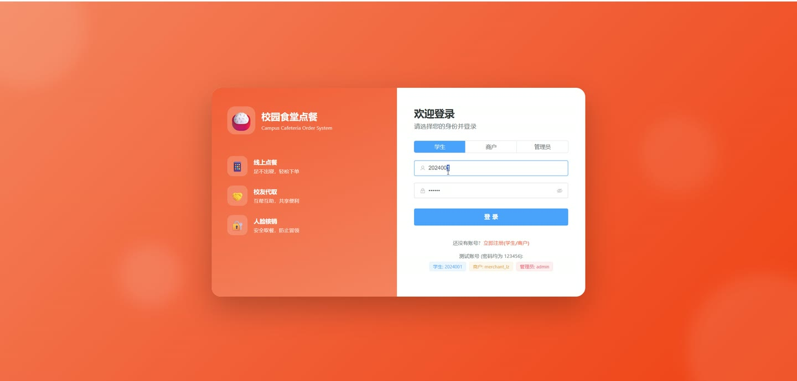
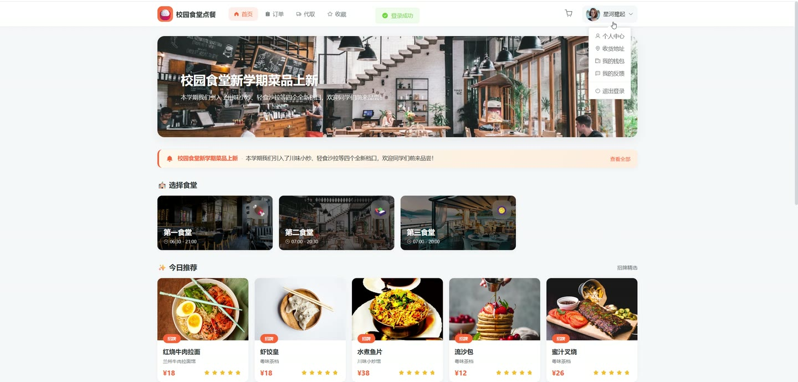
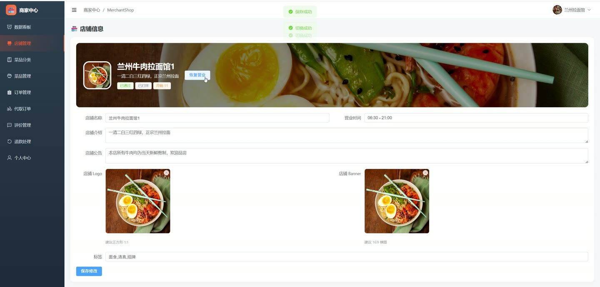
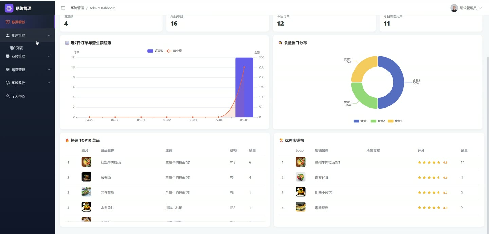
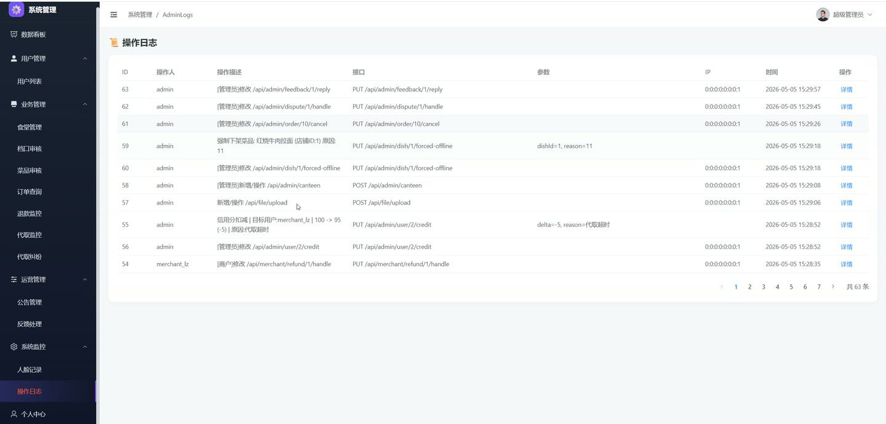
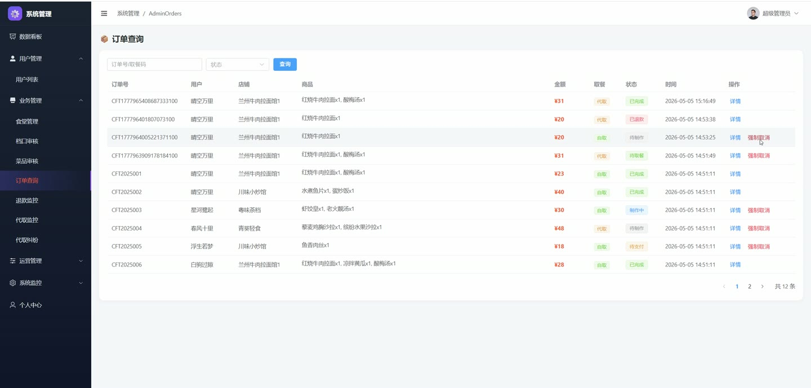

# (附文档)Springboot3+Vue3+MySQL 高校食堂点餐系统

**技术栈**：Springboot3、Vue3、MySQL

### 系统简介

本系统是一套基于 Spring Boot 3 + Vue 3 + MySQL 构建的高校食堂点餐管理系统，采用前后端分离架构，覆盖学生在线点餐、商户档口管理、代取餐与后台管控全流程。系统内置了用户端（学生）、商户端（档口经营者）、管理员端三个角色，支持人脸识别代取、余额充值提现、菜品上下架、退款处理、数据看板等功能。
 
### 核心功能
 
### 普通用户端

 
- 登录/注册：支持学生身份注册，登录后获取 JWT Token，自动识别当前用户身份。 
- 查看个人信息：查看当前登录用户的昵称、头像、余额、积分、信用分等字段。 
- 修改个人信息：编辑昵称、头像、手机号、邮箱等，不支持修改用户名、密码、角色、余额。 
- 修改密码：输入旧密码与新密码完成密码变更。 
- 录入人脸底图：通过摄像头采集人脸照片上传，作为代取餐时人脸识别的比对基准图。 
- 地址管理：新增/编辑/删除收货地址，支持设置默认地址，列表按默认优先排序。 
- 余额概览：查看当前余额、积分、累计充值总额、累计消费总额、累计退款总额。 
- 余额充值：输入金额（单笔上限 10000 元）进行模拟充值，即时到账并记录流水。 
- 余额提现：输入金额（单笔上限 5000 元）进行模拟提现，即时扣减余额并记录流水。 
- 余额流水查询：按类型（充值/消费/退款/提现）筛选分页查看流水明细。 
- 浏览食堂列表：查看所有启用的食堂，按 ID 升序排列。 
- 查看档口列表：按食堂筛选或关键词搜索已审核通过的档口，分页展示。 
- 查看菜品列表：按档口、分类、关键词筛选，支持排序方式（如热销），仅显示上架菜品。 
- 查看菜品详情：查看菜品名称、价格、图片、描述、销量、库存、标签等信息。 
- 查看热销榜：获取全平台销量最高的菜品列表（默认 Top 8）。 
- 查看今日推荐：获取标签为“推荐”“招牌”“新品”的推荐菜品列表（默认 Top 6）。 
- 查看评价：按档口或菜品分页查看用户评价内容、评分、商家回复。 
- 查看公告：按类型筛选已发布的公告，按发布时间倒序排列。
 
### 商户端

 
- 查看我的店铺：获取当前商户绑定的店铺信息，包括名称、Logo、营业时间、评分、审核状态。 
- 编辑店铺信息：修改店铺名称、Logo、联系电话、营业时间、简介等，不允许修改所属食堂。 
- 切换营业状态：一键开启/关闭店铺营业状态。 
- 菜品分类管理：新增/编辑/删除菜品分类，支持自定义排序。 
- 菜品管理：新增/编辑/删除菜品，设置名称、价格、图片、库存、标签、所属分类。 
- 菜品上下架：一键切换菜品的上架/下架状态。 
- 查看本店订单列表：按状态（待支付/已支付/制作中/待取餐/已完成/已取消/已退款）筛选，支持关键词搜索。 
- 更新订单状态：将订单状态推进为“制作中”“待取餐”“已完成”。 
- 查看退款申请列表：按状态（待处理/已通过/已拒绝）筛选本店退款单。 
- 处理退款：同意退款（自动退余额并更新订单为已退款）或拒绝退款（恢复订单为已支付状态）。 
- 查看本店评价列表：分页查看用户对本店的评价内容与评分。 
- 回复评价：商家填写回复内容，记录回复时间。 
- 查看代取订单：分页查看与本档口相关的代取单，支持按状态筛选。 
- 代取单详情：查看代取单信息、代取人详情、人脸识别记录列表。 
- 数据看板：查看本店订单总数、营业额、菜品总数、今日订单数。 
- 近 7 日营业额趋势：按日期展示每日营业额与订单数。 
- 热销 Top 10 菜品：查看本店销量最高的前 10 道菜品。
 
### 管理员端

 
- 数据看板：查看学生数、商户数、档口数、菜品数、订单总数、总营业额、今日订单数、今日新增用户。 
- 近 7 日趋势：查看最近 7 天每日订单量与营业额曲线。 
- 食堂分布：统计各食堂下的档口数量。 
- Top 10 热销菜品：全平台销量最高的 10 道菜品。 
- Top 10 优秀店铺：按销量排序的前 10 家已审核档口。 
- 用户管理：分页查询用户，支持按关键词/角色/状态筛选。 
- 新增用户：创建学生或商户账号，商户账号自动创建待审核店铺。 
- 编辑用户：修改用户昵称、手机号、邮箱、角色、状态等。 
- 重置密码：将指定用户密码重置为 123456。 
- 启用/禁用用户：一键切换用户状态（禁用后无法登录）。 
- 删除用户：删除非管理员用户。 
- 调整信用分：对用户进行信用分奖励或扣减，填写调整分值与原因，记录操作日志。 
- 食堂管理：新增/编辑/删除食堂信息。 
- 档口管理：分页查询档口，支持按食堂/关键词/审核状态筛选。 
- 档口审核：审核通过或驳回档口申请。 
- 编辑/删除档口：修改档口信息或直接删除。 
- 全平台菜品管理：分页查看所有菜品，支持按关键词/档口/状态筛选。 
- 强制下架菜品：填写下架原因，强制将菜品下架并记录操作日志。 
- 恢复上架菜品：将已下架的菜品重新上架。 
- 订单管理：分页查看全平台订单，支持按状态/关键词搜索。 
- 强制取消订单：填写取消原因，强制取消异常订单。 
- 公告管理：新增/编辑/删除公告，支持设置类型与启用状态。 
- 反馈管理：查看用户反馈列表，支持按状态筛选，回复反馈并标记为已处理。 
- 退款管理：查看全平台退款申请，按状态筛选。 
- 代取订单管理：查看全平台代取单，按状态筛选。 
- 代取纠纷处理：查看纠纷列表，处理纠纷（标记处理中/已解决/已驳回），填写管理员回复。 
- 操作日志：分页查看所有管理员操作日志，按时间倒序排列。 
- 人脸识别记录：查看所有人脸识别比对记录，关联用户名，按时间倒序排列。
 
### 技术栈

  后端框架 Spring Boot 3   ORM MyBatis-Plus   权限认证 Spring Security + JWT   前端框架 Vue 3   状态管理 Pinia   构建工具 Vite   数据库 MySQL   HTTP 客户端 Axios   文件上传 MultipartFile + Hutool   人脸识别 百度 AI 人脸对比 API 
 
### 交付内容

 
- 后端完整源码 
- 前端完整源码 
- 数据库初始化脚本 
- 万字文档

## 界面展示

---

## 获取完整源码 + 万字文档

本仓库为项目介绍页。**完整前后端源码、数据库初始化脚本、万字项目文档**，请加微信 `kangkangcode`，或访问 [codekk.top](http://codekk.top) 获取。

可作课程设计 / 毕业设计参考，支持远程部署调试。